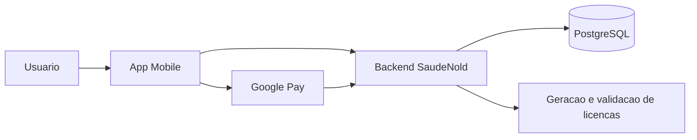
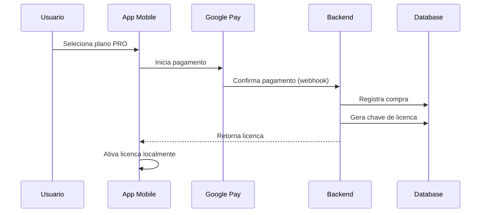
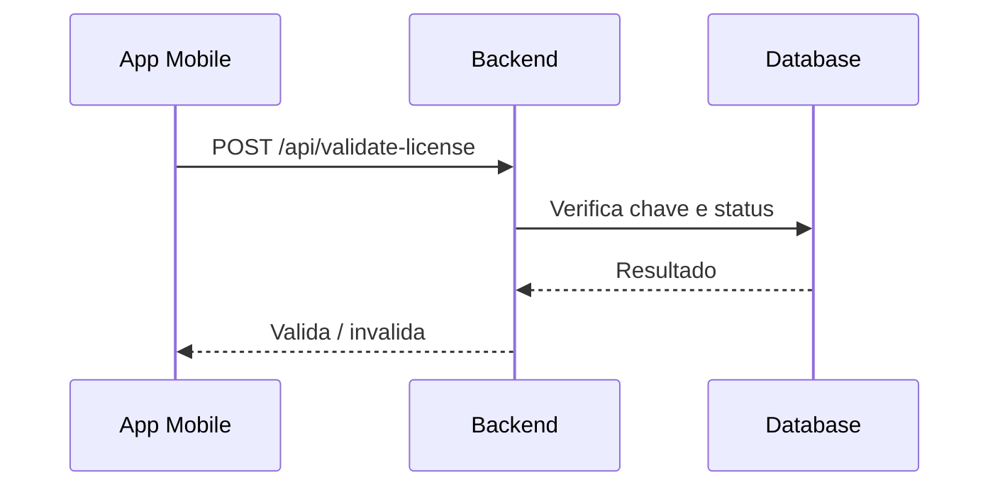

## Diagramas de Arquitetura - Licenca PRO

### Visao geral (alto nivel)

```mermaid
flowchart LR
  User[Usuario] --> App[App Mobile]
  App --> Backend[Backend SaudeNold]
  Backend --> DB[(PostgreSQL)]
  App --> GP[Google Pay]
  GP --> Backend
  Backend --> License[Geracao e validacao de licencas]
```

### Fluxo de compra e ativacao

```mermaid
sequenceDiagram
  participant U as Usuario
  participant A as App Mobile
  participant G as Google Pay
  participant B as Backend
  participant D as Database

  U->>A: Seleciona plano PRO
  A->>G: Inicia pagamento
  G->>B: Confirma pagamento (webhook)
  B->>D: Registra compra
  B->>D: Gera chave de licenca
  B-->>A: Retorna licenca
  A->>A: Ativa licenca localmente
```

### Fluxo de validacao da licenca

```mermaid
sequenceDiagram
  participant A as App Mobile
  participant B as Backend
  participant D as Database

  A->>B: POST /api/validate-license
  B->>D: Verifica chave e status
  D-->>B: Resultado
  B-->>A: Valida / invalida
```

